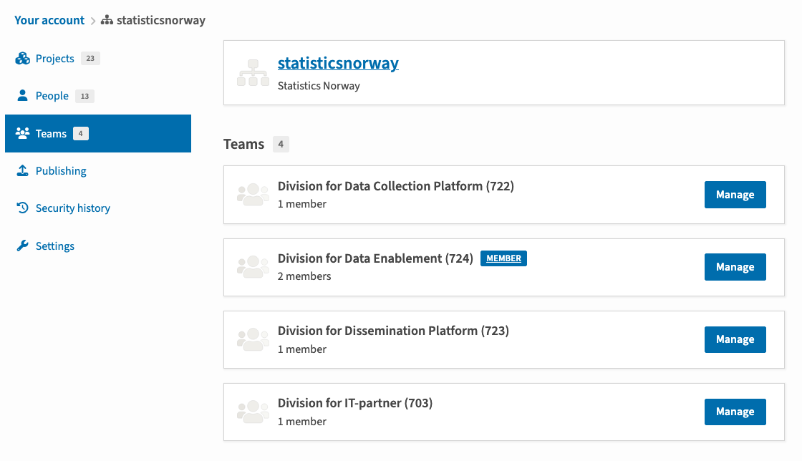
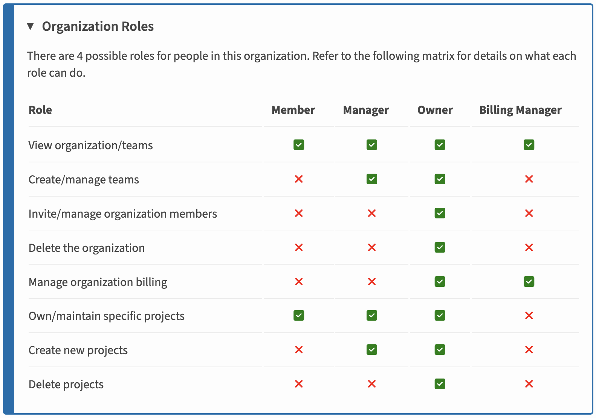

---
tags:
  - pypi
---

# PyPI organisasjon

## Introduksjon

<https://pypi.org/org/statisticsnorway/>

## Struktur og roller

### Team

Innenfor en PyPI organisasjon er det støtte for ulike team. Fordelen med det er at et team kan ha tilgang til å administrere sine pakker men ikke tilgang til andre sine pakker.

Det er vedtatt at python pakker skal eies av seksjoner. Hvert PyPI team skal dermed representere en SSB seksjon, navngitt i engelsk i formen “Division for a particular statistic - (888)”. [De engelske navn for seksjonene finnes på Klass](https://www.ssb.no/en/klass/klassifikasjoner/83).

### Roller

<https://docs.pypi.org/organization-accounts/roles-entities/>

I utganspunktet kommer alle til å ha rollen **Member**. I tillegg må det være an gruppe med rollen **Owner**. Disse kommer til å ha ansvar for at eierskapet til organisasjonen oppretteholdes samt utføre alle operasjoner som er ikke mulig for **Members**.

> [!IMPORTANT]
> *Et forslag er å ha 1-2 personer med **Maintainer** rollen per avdeling.*

> [!IMPORTANT]
> Det må avklares en kanal for kommunikasjon angående pakker og organisasjonen.

## Hvordan overføre en pakke til organisasjonen?

> [!IMPORTANT]
> Denne beskrivelsen er for de som har rollen *Maintainer* på statisticsnorway på PyPI.

For å kunne overføre en pakke må man være *owner* på pakken som skal overføres, samt være *manager* eller *owner* på organisasjonen det skal overføres til.

Hvis du ikke allerede er eier av biblioteket som skal overføres, så be eksisterende eier om å legge deg til som eier.

Se videre beskrivelse her:<https://docs.pypi.org/organization-accounts/actions/project-actions/#transfer-a-project>

## Hvordan tilordne en pakke til et bestemt team/seksjon i organisasjonen?

TBD

## TODO

- [x] Opprette organisasjon på pypi.org
- [ ] Opprette organisasjon på test.pypi.org
- [x] Migrere pakkene fra A700
- [ ] Oppdatere ADRene

- [ ] <https://adr.ssb.no/0007-python-pakkelager/>
- [x] <https://adr.ssb.no/0008-felles-eierskap-av-artefakter/>

- [ ] Kommunisere ut til alle Python brukere i SSB
- [ ] Migrere pakkene fra A400
- [ ] Migrere pakkene fra A300
