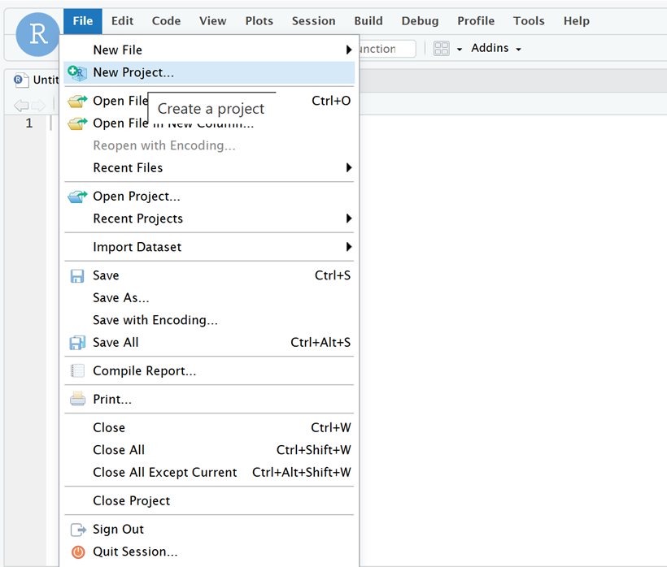
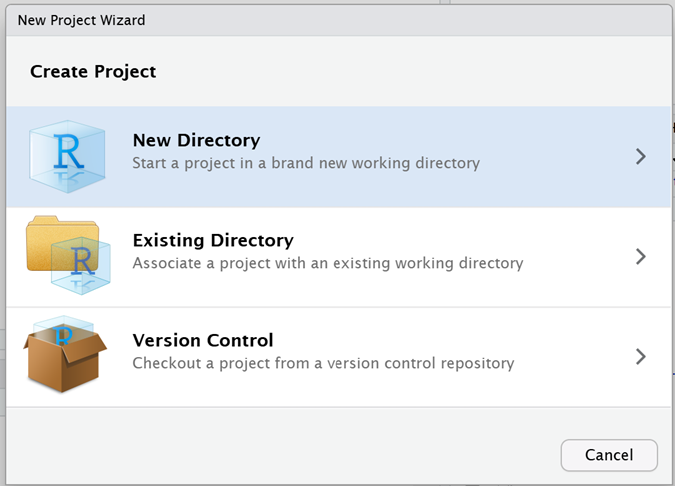
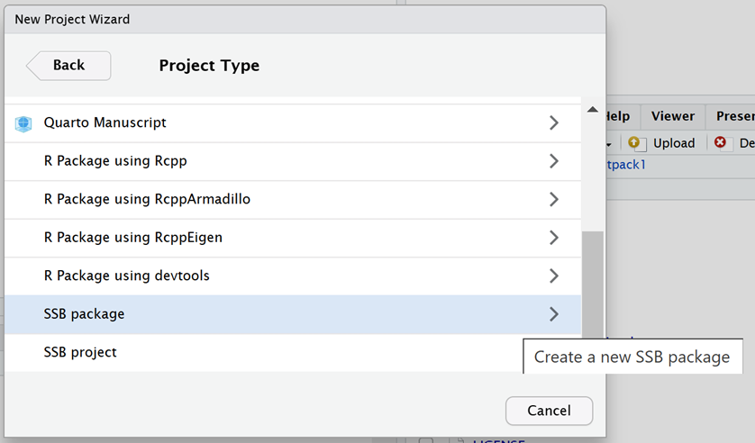
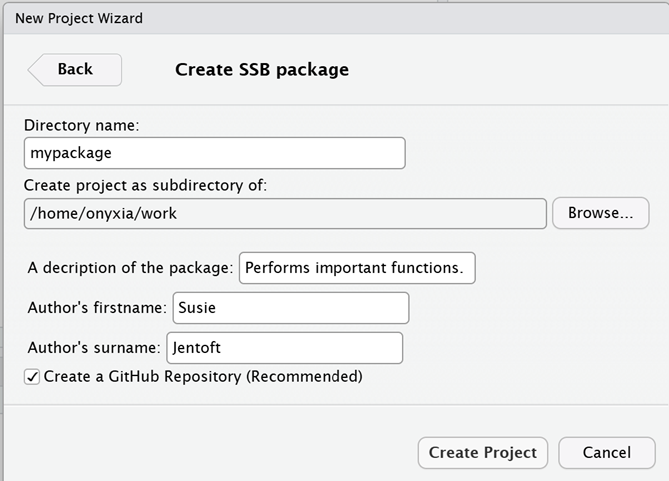

---
tags:
  - github
  - r
  - bibliotek
---

# Hvordan lage et R-bibliotek etter SSB standard?

Status: <mark style="background: #f8e6a0;">UTKAST</mark>

> [!IMPORTANT]
> Tenk deg at du har en eller flere funksjoner som bør deles med andre som ikke jobber i det samme git-repoet som deg. Hvordan gjør du det etter god SSB-standard?
>
> Denne siden tar den gjennom denne prosessen, helt fram til at pakken er publisert på [CRAN](https://cran.r-project.org/).

**Innholdsfortegnelse**

## Før du starter

### Er det allerede en pakke hvor funksjoner kan legges inn?

Sjekk om de funksjonene du ønsker å dele kan passe å legge til i et av de SSB R-pakkene vi allerede har. Ta kontakt med kontaktperson for pakken. Du finner en liste over alle R-pakker på [SSBs GitHub ved å søke med labell “r-package”](https://github.com/search?q=topic%3Ar-package+org%3Astatisticsnorway&type=Repositories).

### Velg et navn

Neste punkt er å velge et navnfor pakken. R-pakker navn skal helst være kort og med småbokstaver. De skal ikke inkludere “\_” eller “-” så er det lurt å velge et navn som er ett ord. Husk å sjekke om navn er ledig på [CRAN](https://cran.r-project.org/web/packages/available_packages_by_name.html) slik at du kan publisere det offentlig. I følge [navnstandard for GitHub-repoer](https://github.com/statisticsnorway/adr/blob/main/docs/0014-navnestandard-github-repoer.md) skal git-repo navn for fellespakker begynne med `ssb-`. Dette blir lagt på automatisk slik at du trenger ikke å skrive det.

### Krav til pakker

Gruppen Kvalitet i kode og kode (KVAKK) har satt opp noen krav og anbefalinger til pakker som lages i SSB. Se [Regler og anbefalinger fra KVAKK](../../Regler%20og%20anbefalinger%20fra%20KVAKK.md). Det går på ting som navnestandard, kodekvalitetssjekker, dokumentasjon og testing. Malen nedenfor dekker alle reglene i retningslinjene og mange av de anbefalinger.

### Sjekk rettighetene til ditt GitHub Personal Access Token (PAT) inkluderer “workflow”

Når du skal sende noe til GitHub så spør git om et passord, eller rettere sagt et token, for å autentisere deg. Dette tokenet trenger å ha *scope*: ***repo*** **og** ***workflow**.* Sjekk hvilke scope tokenet ditt har ved å logge inn på GitHub, klikk på

> Ikonet ditt oppe til høyre > Settings > Developer settings (helt nederst til venstre), > Personal access tokens > Tokens(classic).

Hvis tokenet ditt mangler et av scopene så oppdater tokenet ved å klikke på tokenet (blå tekst), legg til aktuelle scope og klikk på “*Update token*”-knappen nederst.

## Mal for SSB R-pakker

Vi har laget en mal for R-pakker for å ta hensyn til alle krav og anbefalinger som er nevnt ovenfor. Malen er tilpasset for RStudio og kan brukes lokalt på PC, i prod.sone eller Dapla Lab.

**Malen er (snart)** **installert i prod. sone og Dapla Lab**. Men hvis du jobber i RStudio lokalt på PC kan du installere det ved:

```java
remotes::install_github("statisticsnorway/ssb-templater")
```

For å bruke malen, start RStudio og velg

> File > New Project…



Deretter velger du New Directory…



Og så finne SSB package fra listen



Da får du opp et vindu hvor du kan fylle inn navne til pakke (Directory name), beskrivels av pakken og navnet ditt.



Du kan også velge om du vil opprette en GitHub repo på statisticsnorway område ved oppsett av pakken (anbefalt).

Når du trykke på “Create Project” starter malen å sette opp en ny mappe til pakke og installerer de nødvendige filer. Hvis du velge å opprette en GitHub repo, blir du spurt etter GitHub PAT.

- Fylle inn GitHub PAT hvis du blir spurt
- Velge å overskriver filer om det kommer spørmål om dette
- Velge å commit nye filer om du blir spurt.

### Konfigurering av GitHub-repo

For pakkene å være tilgjenglig for andre, er det best om GitHub-repoet er tilgjengelig med “public” tilgang.

> [!IMPORTANT]
> Målet er at konfigureringen av GitHub-repoet skal kunne settes opp automatisk av SSBs R-pakke mal. Det meste settes opp automatisk men det er viktig å sjekke gjennom konfiguering.

1. Det settes en del krav til hvordan et public GitHub repo i SSB skal være konfigurert. se [ADR0006](https://github.com/statisticsnorway/adr/blob/main/docs/0006-aapen-kildekode-i-ssb.md#kriterier-for-%C3%A5pen-kildekode). Sørg for at disse er oppfylt. Se beskrivelse av [Hvordan opprette nytt GitHub-repo?](../../Versjonskontroll%20med%20Git/Hvordan-beskrivelser/Hvordan%20opprette%20nytt%20GitHub-repo_.md) for detaljer, og legg til hvem som skal ha tilgang til repoet (beskrivelse på forrige lenke).
2. **Send en e-post** til [sikkerhetssenter@ssb.no](mailto:sikkerhetssenter@ssb.no) og be om at repoet gjøres public.
3. Etter at repoet er public, er det anbefalt å sette opp <https://docs.github.com/en/code-security/security-advisories/working-with-repository-security-advisories/configuring-private-vulnerability-reporting-for-a-repository>

## Egen kode

### Legg inn egen kode i R-mappen

Funksjoner skal ligger som .R filer og skal flytte inn i mappen som heter *R*. Det er anbefalt å dokumentere funksjoner ved [roxygen2](https://roxygen2.r-lib.org/). Da kan du gi funksjoner et navn og beskrivelsen i tillegg til å spesifisere parameter og det som returneres. Det er alltid god praksis å lage noen enkel eksempler som viser hvordan funksjoner fungere. Mer om dokumentasjon av koden ved roxygen2 finner du på siden for [funksjon dokumentatsjon](https://r-pkgs.org/man.html).

### Tilpasse DESCRIPTION

DESCRIPTION filen sier noen generelt om pakken du lager. Det inkluderer navn av pakken, beskrivelsen og hvem som har skrevet det. Filen kan åpnes og redigeres direkte i RStudio. Hvis funksjonene i pakken din er avhengig av andre pakker, må de avhengige pakke skrives inn i DESCRIPTION. Les mer om dette på [Hadley Wickhams siden for R-pakker](https://r-pkgs.org/description.html#sec-description-imports-suggests)

### Test og fiks

Det er viktig at pakken testes, både for problemer med struktur/oppsett men også for kode. For å sjekke oppsett, formattering og alle testene kan du velge fra RStudio meny:

> Build > Check Package

KVAKK regel R-043 sier at [[alle biblioteker skal ha tilhørende tester]]. For **enhetstester** i R, anbefales det å bruk [testthat](https://testthat.r-lib.org/). Eksempler med bruk av testthat finner du på [Eksempler på enhetstester i R](../../Test%20og%20kodekvalitet/Hvordan-beskrivelser%20for%20test%20og%20kodekvalitet/Eksempler%20på%20enhetstester%20i%20R.md).

Pakken skal har **dokumentasjon** for alle funksjoner (som er eksportert) og hvordan de skal brukes ([[R-042]]). Som en del av SSBs mal for R-pakker, blir dokumentsider opprettet ved bruk av [pkgdown](https://pkgdown.r-lib.org/). Sidene blir generert automatisk men kan justeres ved behov, og inkludere flere guides/vignette. [Se her for mer informasjon om quarto vignetter](https://pkgdown.r-lib.org/articles/quarto.html).

Flere verktøy i R kan benyttes for å øke kvalitet av kode. F. eks automatisk formattering, sjekking for feil struktur og deking av enhetstester. Mer info om disse verktøy finner du på [Kodekvalitetsverktøy for R](../../Test%20og%20kodekvalitet/Hvordan-beskrivelser%20for%20test%20og%20kodekvalitet/Kodekvalitetsverktøy%20for%20R.md).

### Pull request og merge

Når du er fornøyd med endringer, commit og push endringer til GitHub. Deretter, logg inn på repoet på GitHub og opprett en pull-request.

Tips:

- Vent med å legge til *Reviewers* til du ser at alle sjekker er “grønne”. Noen av testene kjøres først når du oppretter en pull-request.

Når pull requesten er godkjent, så merger du den og sletter branchen.

## Publisering

R-pakker kan installeres direkte fra GitHub. Hvis pakken har *public* tilgang, er det mulig å installere det i et renv miljø. F. eks med:

```java
renv::install("statisticsnorway/ssb-mypakke")
```

### CRAN

Hvis pakken kan være relevant for andre utenfor SSB (f.eks. andre statistikk produsenter) er det nyttig å publisere pakken på CRAN. Dette er ikke lett å automatisere men relativ enkelt å gjøre manuelt.

1. Lage pakken som en *source* fil (tar.gz). I Rstudio velg: Build > Build Source Package
2. Fylle inn skjem på CRAN, laste opp source filen og følg instruks: <https://cran.r-project.org/submit.html>

### Lag en release

Release blir ikke generert automatisk. Det kan være en ide å lage Release med versjonsnummer til pakken for at det er enkle for brukere å installere tidligere versjoner. Du finner noen tips om [hvordan å lage Release i GitHub her](https://docs.github.com/en/repositories/releasing-projects-on-github/managing-releases-in-a-repository). Vanlig standard for *tags* til Release i R er å bruk *v* og versjonsnummeren til pakke, f.eks. *v0.0.1*
