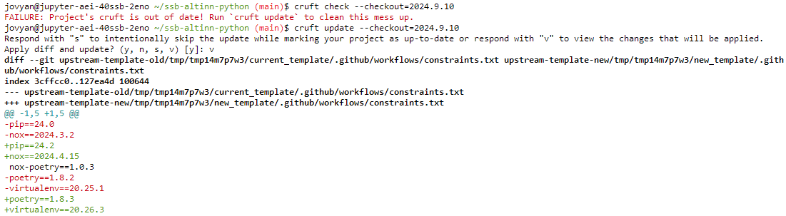
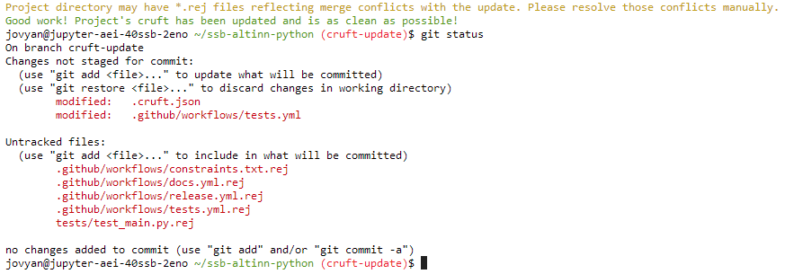

---
tags:
  - pypitemplate
  - python
  - cruft
  - github
---

# Hvordan oppdatere GitHub-repo med oppdateringer fra underliggende mal?

Status: <mark style="background: #baf3db;">I BRUK</mark>

> [!IMPORTANT]
> Alle GitHub-repoer som er opprettet med `ssb-project` kommandoen baserer seg på en mal, enten [standardmalen](https://github.com/statisticsnorway/ssb-project-template-stat) eller [ssb-pypitemplate](https://github.com/statisticsnorway/ssb-pypitemplate). Av og til kommer det oppdateringer og forbedringer i den underliggende malen. Denne siden beskriver hvordan du kan få inn disse endringene inn til ditt eget GitHub-repo.

> [!WARNING]
> Det anbefales at det repoansvarlig eller en med erfaring med å håndtere mergekonflikter som gjennomfører en slik oppdatering. Eller be om hjelp fra avdelingens støtteteam eller tech-coacher (kontaktes på it-partner@ssb.no)

## Cruft

`ssb-project` bruker et verktøy som heter [cruft](https://cruft.github.io/cruft/) til å opprette GitHub-repoer basert på en mal. Det er også dette verktøyet vi bruker for å se på hvilke endringer som har kommet i malen og oppdatere repoet med endringene. Cruft-verktøyet er ferdig installert på Dapla og DaplaLab.

## Steg-for-steg beskrivelse

1. Åpne et terminalvindu og gå til rot-mappen på det aktuelle repoet. Sjekk at du er på en oppdatert versjon av main-branchen, og at `git status` ikke lister noen endrede filer. Det gjør du slik:

   ```bash
   git switch main  # Bytter til main-branchen
   git status       # Sjekk at status ikke viser endrede filer. Hvis endringer
                    # så sett tilstanden tilbake til forrige commit med kommandoen:
                    # git reset --hard HEAD
   git pull         # Henter inn eventuelle oppdateringer på main-branchen fra GitHub
   ```
2. Sjekk hva som er siste release av den malen du bruker. Det er to maler: ssb-pypitemplate for repoer som er python-bibliotek, det vil si begynner med `ssb-`, og standardmal for `stat-` repoer og andre. Det gjør du på [denne siden for standardmalen](https://github.com/statisticsnorway/ssb-project-template-stat/releases) og på [denne siden for ssb-pypitemplate](https://github.com/statisticsnorway/ssb-pypitemplate/releases). Eksempel: 1.8.0 for standardmalen og 2026.5.27 for ssb-pypitemplate.
3. Sjekk om du trenger å gjøre oppdateringer: `cruft check --checkout=<release-nummer>`.  
   Eksempel: `cruft check --checkout=2026.5.27` for ssb-pypitemplate, og `cruft check --checkout=1.8.0` for standardmalen for statistikkrepoer.   
   Typisk svar: “*FAILURE: Project's cruft is out of date! Run cruft update to clean this mess up*”  
   Hvis du får som svar at alt er oppdatert, så trenger du ikke gjøre noe mer.
4. Lag en ny branch for jobben vi skal gjøre nå: `git switch -c cruft-update`
5. Kjør kommandoen `cruft update --checkout=2026.5.27` hvis det er et bibliotek-repo, og `cruft update --checkout=1.8.0` hvis det er standardmalen det gjelder. Se gjennom endringene (velg “v” for view). Bla deg videre til neste sider ved å trykke på mellomromstasten og trykk på bokstaven “q” til slutt for å avslutte visningen. Se eksempel nedenfor.

   
6. Velg nå “y” for yes. Cruft merger nå endringene i malen inn til din branch i ditt repo. Noen ganger vil cruft klare å løse ut alle forskjeller, men ofte vil du få merge-konflikt på noen filer, spesielt på filen `poetry.lock` (gjelder ikke repoer som er basert på ssb-pypitemplate). Se eksempel:

   
7. Sjekk resultatet. Spør gjerne om hjelp hvis du synes denne delen er vanskelig. Ta kontakt med støtteteamet på din avdeling eller noen av tech-coachene, som kan kontaktes på [it-partner@ssb.no](mailto:it-partner@ssb.no). Sammenlign gjerne med hvordan filene ser ut i en standard instans av malen, se [ssb-pypitemplate-instance](https://github.com/statisticsnorway/ssb-pypitemplate-instance).  
   Det er tre ting du bør sjekke:

   1. Sjekk `.rej`-filene og pass at endringene i `.rej`-filene har kommet med i filen den referer til. Noen ganger har cruft klart å løse det ut selv, andre ganger ikke. Et `+`tegn på starten av en linje betyr at en linjen er lagt til, og et `-`tegn betyr at den er fjernet. Tips: vis `.rej`-fil og tilhørende fil side ved side i Jupyter eller vscode. Da er det lettere å sammenligne.
   2. Se gjennom alle endrede filer og sjekk at resultatet er som forventet, men ikke bry deg om filen `poetry.lock` siden den kan vi regenerere etterpå. Hvis noen av filene inneholder mergekonflikt linjer av type (<<<<<<\<, =======, og \>>>>>>>), så må du velge hvilken av de to alternativene du vil ha og slette det andre.
   3. Legg til alle nye filer (untracked) som ikke er `.rej`-filer inn i git.
8. Hvis filen `poetry.lock` er endret eller har `.rej`-fil: Regenerer `poetry.lock` filen ut fra `pyproject.toml`:

   ```bash
   rm poetry.lock       # Slett filen med konflikter
   poetry update        # Lager ny poetry.lock med oppdaterte avhengigheter
   git add poetry.lock  # Legger til oppdaterte filen klar til commit i git
   ```
9. Oppdater avhengighetene med kommandoen: `poetry update`
10. Når alle filene er slik du forventer så lager du en commit:

    ```java
    git add -u           #  Gjør alle endrede filer klar for commit 
    git commit -m"Update to new version of template"
    ```
11. Gjør eventuell testing for å sjekke at alt virker som det skal. Deretter `git push` og lag pull request som beskrevet på [Hvordan er anbefalt git arbeidsflyt?](../../Versjonskontroll%20med%20Git/Hvordan-beskrivelser/Hvordan%20er%20anbefalt%20git%20arbeidsflyt_.md).

## Video

Vi har laget en video som viser hvordan man oppdaterer et GitHub-repo med endringer fra underliggende mal i praksis. Først og fremst for gi en hjelp til punkt 7, som kan være litt vanskelig.
