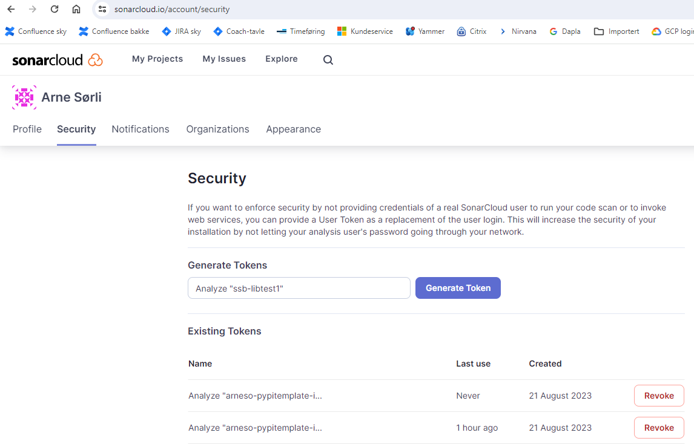
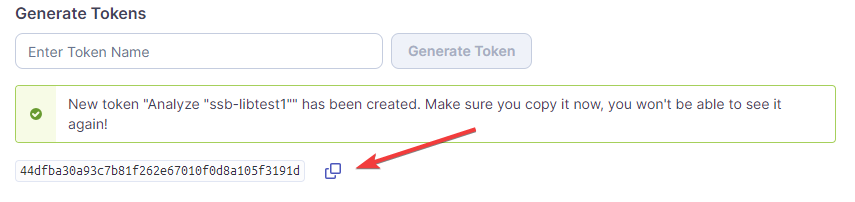
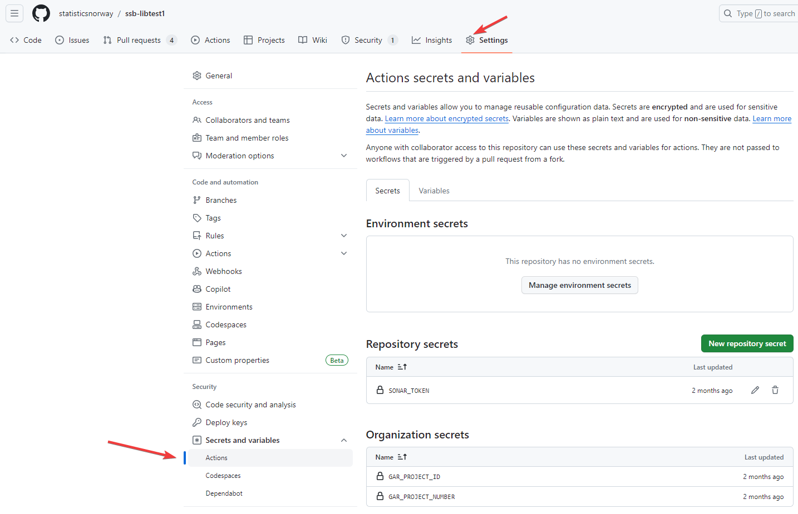

---
tags:
  - sonarcloud
  - python
---

# Hvordan opprette Sonar token manuelt?

Status: <mark style="background: #baf3db;">I BRUK</mark>

> [!IMPORTANT]
> Denne siden er for de som bruker SonarCloud med analysemetode: GitHub Actions. Det vil blant annet si alle biblioteker som er basert på [Hvordan lage et python-bibliotek etter SSB standard?](../Hvordan%20lage%20et%20python-bibliotek%20etter%20SSB%20standard_.md).
>
> Det er for tiden en feil i SonarCloud som gjør at man ikke får opp en tutorial når man velger analysemetode GitHub Actions, og man må derfor sette det opp manuelt. Denne siden beskriver hvordan.

## Opprett SONAR\_TOKEN for repoet som skal analyseres

Hvert repo som skal analyseres med GitHub Actions trenger et SONAR\_TOKEN. Det kan du opprette manuelt ved å:

1. Logg inn i [SonarCloud](https://www.sonarsource.com/products/sonarcloud/) med GitHub-kontoen din.
2. Klikk på avataren din oppe til høyre og velg “My Account”. Klikk på Security arkfanen. Da får du opp en skjermbilde ala det nedenfor.

   
3. Under *Generate Tokens* skriver du en beskrivelse som inneholder reponavnet og klikker på *Generate Token* knappen. Da lager den et token som du kopierer.

   
4. Gå til det aktuelle repoet på GitHub og velg *Settings*-tannhjulet (du må være admin på repoet). Deretter velger du *Secrets and variables* og *Actions*, og klikker på *New repository secret*-knappen.

   
5. Navnet på tokenet skal være `SONAR_TOKEN`. Så limer du tokenet du kopierte i punkt 3 inn i *Secret*-feltet og klikker på *Add secret*-knappen.
