# Hvordan bruke pull request på GitHub?

Status: <mark style="background: #baf3db;">I BRUK</mark>

## Video

Her er et videoopptak som viser de ulike stegene i denne beskrivelsen:

## Opprett pull request

> [!IMPORTANT]
> Hvis du nylig har pushet kode til repoet vil det dukke opp en grønn knapp “Create a pull request“ på forsiden av repoet. Trykk på knappen for å opprette en PR.

1. Gå til ditt aktuelle repoet på GitHub.
2. Velg fanen “Pull Requests“ og deretter på den grønne knappen “New pull request“
3. Velg hvilke branch du ønsker å slå sammen:

   1. ***compare:*** - Branchen med endringene dine.
   2. ***base:*** - Hovedversjonen av prosjektet. Dette heter som regel **main**.
4. Trykk på den grønne knappen “Create pull request“

   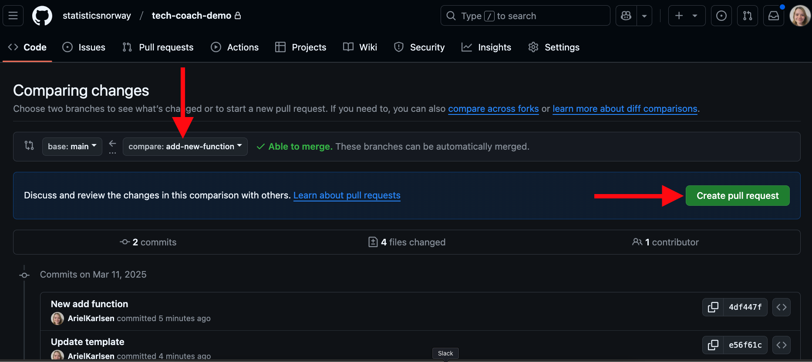
5. Fyll inn tittel på PR-en og legg til en oppsummering av hva som er gjort og hvorfor. Kommenter også hvis det er bestemte ting reviewerne bør ha fokus på.
6. Klikk på den grønne “Create pull request“ knappen.

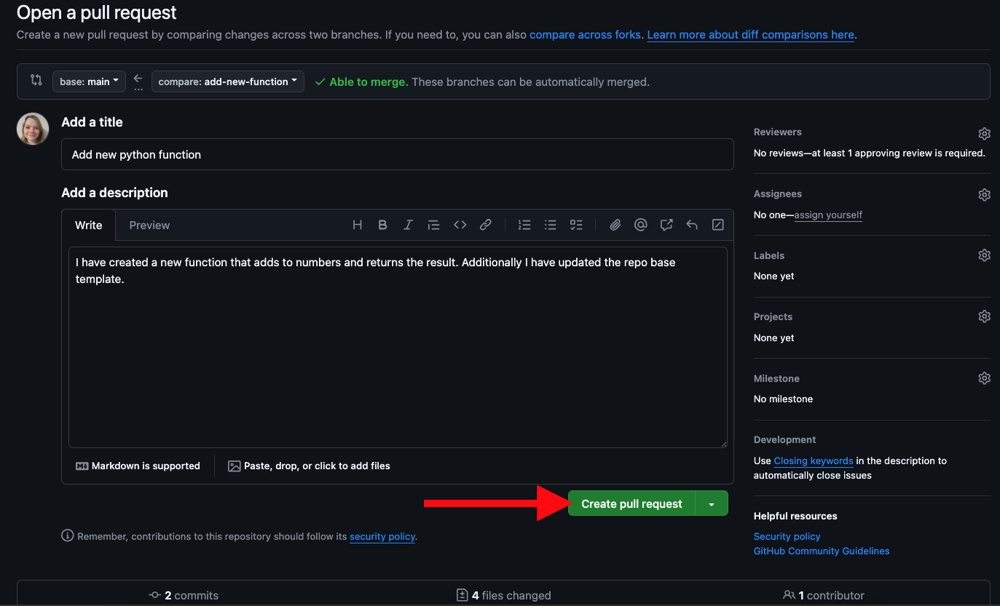

### Angi personer som skal se på koden

Når det står du har opprettet en pull request kan du tildele personer eller en gruppe som skal gjennomgå koden din:

1. Sjekk at knappen til venstre for “All checks have passed“ er grønn.
2. Klikk på “Reviewers“ i sidepanelet.
3. Velg hvem som skal gjennomgå koden.

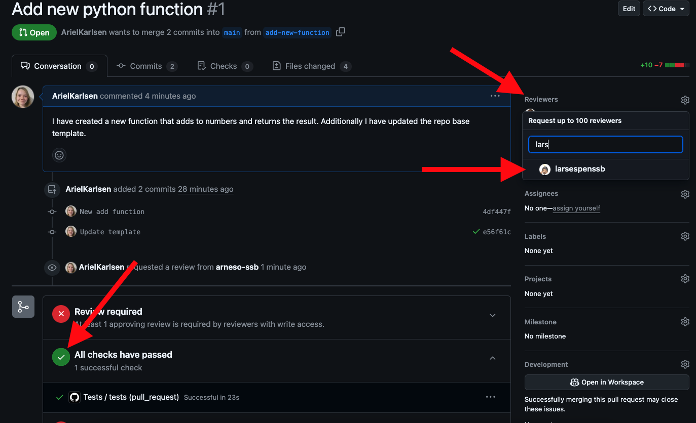

## Godkjenn pull request uten kommentarer

> [!IMPORTANT]
> Hvem kan godkjenne en PR? De som har skrivetilgang på repoet, som regel teamet ditt

1. Finn pull requesten i GitHub

   1. Navigere deg til det aktuelle repoet og åpne fanen for “Pull requests“. Velg den pull request du ønsker å gi tilbakemelding på.
2. Gjennomgå endringene

   1. Se over de foreslåtte endringene ved å klikke på fanen “Files changed“.
3. Godkjenn pull request

   1. Når du er klar for å gi tilbakemelding trykker du på “Review changes“ øverst til høyre.
   2. Velg en av følgende alternativer:

      1. ✅ Approve (Godkjenn) - hvis endringene er godkjent.
      2. ❌ Request changes - hvis endringer er påkrevd.
      3. 🗒️ Comment - hvis du bare vil gi en tilbakemelding uten å godkjenne eller avvise.
   3. Legg ved en kort kommentar om ønskelig og klikk “Submit review“.

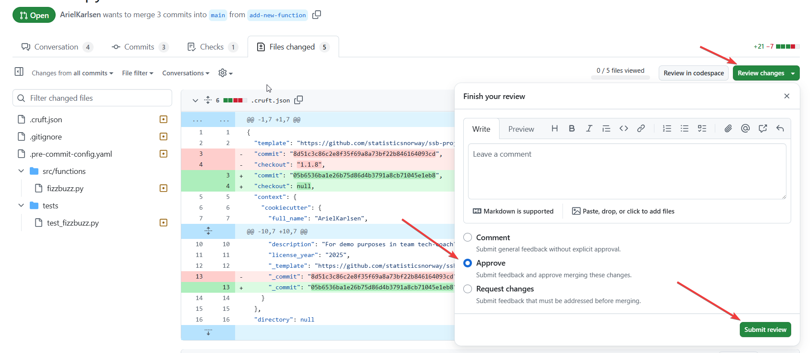

## Kommentere på en pull request

### Kommenter på et sted i en enkeltfil

Hvis du vil gi tilbakemelding på en spesifikk linje i koden:

1. Gå til “Files changed“-fanen i pull requesten eller klikk på den grønne “Add your review“ knappen.

   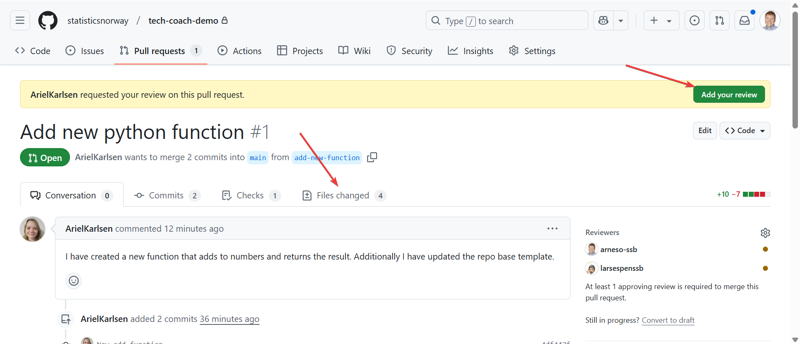
2. Hold musepekeren over linjen du vil kommentere, og klikk på “+“-ikonet ved siden av linjenummeret.

   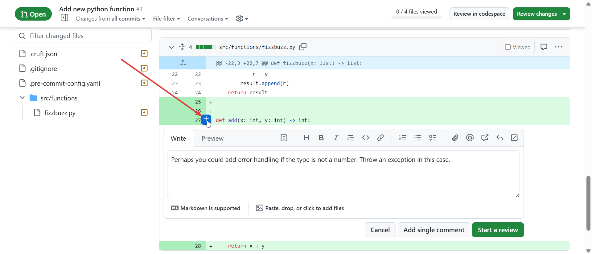
3. Skriv inn kommentaren din og klikk “Start a review“ hvis du vil samle flere kommentarer før du sender dem, eller “Add single comment“ hvis du kun vil gi én kommentar.
4. Hvis du velger “Start a review“ kan du kommentere flere steder i koden før du gjør deg ferdig ved å trykke på “Finish your review“.

   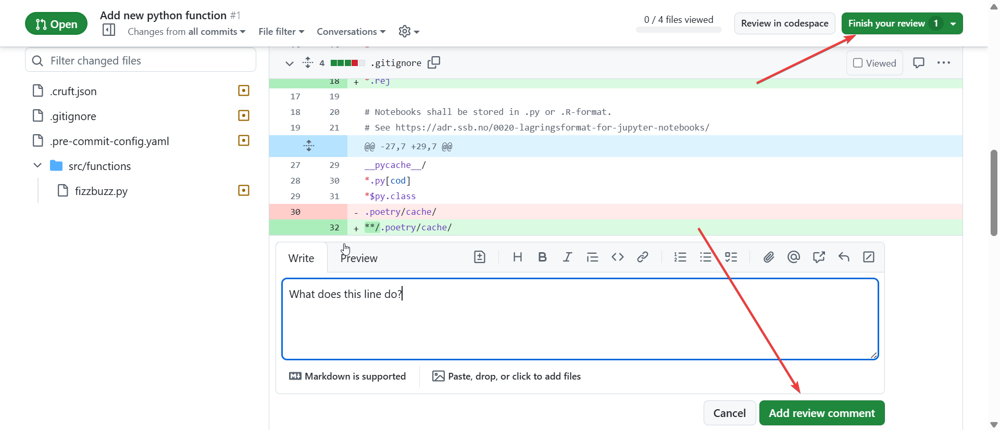
5. Velg om du ønsker å godkjenne, be om endringer eller bare kommentere pull requesten. Se videre beskrivelse under [Hvordan bruke pull request på GitHub?](Hvordan%20bruke%20pull%20request%20på%20GitHub_.md).

### Gi en generell kommentar på pull requesten

Hvis du vil gi en generell tilbakemelding på hele pull requesten:

1. Gå til “Conversation“-fanen.
2. Klikk i kommentarfeltet nederst på siden og skriv inn din kommentar.
3. Klikk “Comment“ for å legge til kommentaren.

### Syntaks i kommentarer, samtaler med mer

- For å varsle spesifikke personer er det mulig å bruke `@brukernavn`.
- Du kan bruke Markdown for formatering, f.eks. `**bold**` eller `*italic*`.
- Bruk Markdown-syntaksen `[tekst](url)` for å lage en lenke med egendefinert tekst.

## Hvordan svare på kommentarer og rette opp i pull request?

### Hvordan svare på kommentarer i en pull request

1. Trykk “Reply…“ feltet under kommentaren og svar på kommentaren.
2. Hvis du mener at samtalen er ferdig eller problemet er løst, så trykker du på “Resolve conversation“ for å lukke tråden.

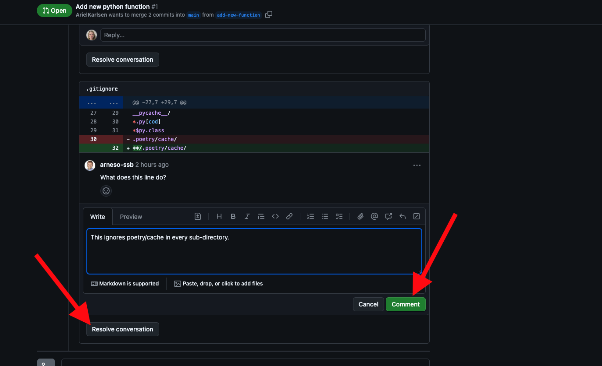

### Nye committer

Hvis du trenger å legge til endringer i koden etter at du har opprettet en pull request:

1. Gjør nødvendige endringer på eksisterende branch.
2. Commit og push til GitHub.
3. Endringene vises automatisk i pull requesten på GitHub.

### Be om nytt review

Etter at du har gjort nødvendige oppdateringer, kan du be om en ny gjennomgang:

1. Gå til pull requesten på GitHub.
2. Klikk på “Re-request review“ ved siden av navnet til en tidligere reviewer. Det sendes da ut en e-post til personen du valgte.

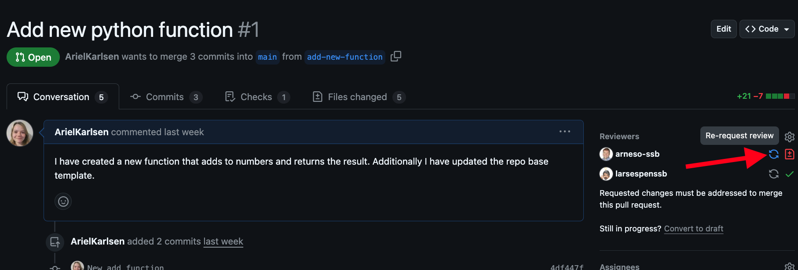

### **Review av nye endringer**

Hvis du blir bedt om å se over nye endringer på nytt kan du se hva som er endret siden sist:

1. Trykk på “Files changed“ i pull requesten.
2. Trykk på “Changes from all commits“ og velg “Show changes since your last review“.
3. Selve reviewet gjøres som beskrevet tidligere.

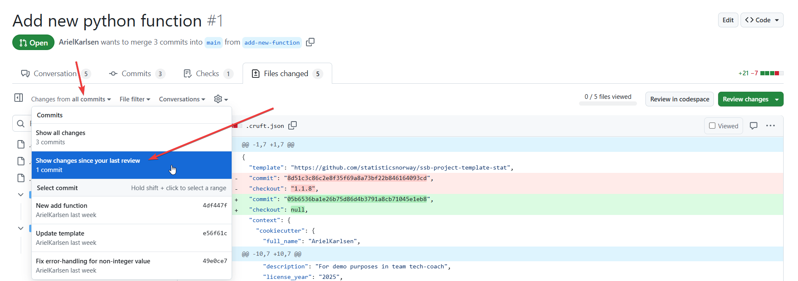

## Merging av pull request

Når en PR er godkjent kan PR-en merges. Det anbefales at den som opprettet PR-en er den som merger:

1. Trykk på den grønne knappen nederst i pull requesten.
2. Velg hvordan du ønsker å merge koden:

   1. “Merge pull request“ - Normalt velger du denne
   2. “Squash and merge“ - Avansert valg som kommer fram hvis du trykker på pilen til høyre i den grønne boksen. Brukes hvis du har mange små commiter som du vil slå sammen til én commit.

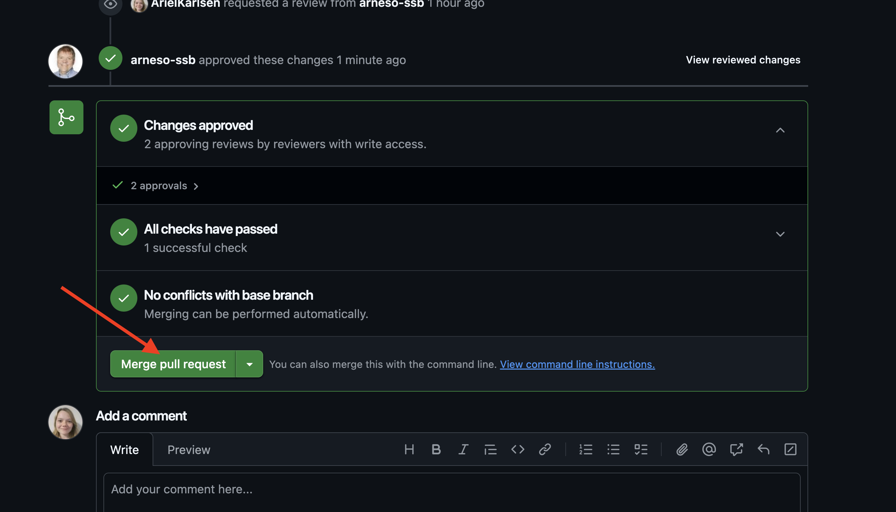

3. Bekreft ved å klikke på “Confirm merge“
4. Når pull requesten er merget rydder du opp etter deg ved å klikke på “Delete branch“ knappen.

   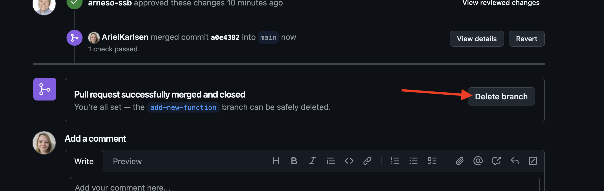

## Avansert: Hvordan reversere en pull request

1. Gå inn på pull requesten du ønsker å reversere. Dette gjør du ved å klikke på “Pull requests“ og deretter “Closed“. I listen over pull requests klikker du på den du ønsker å reversere.

   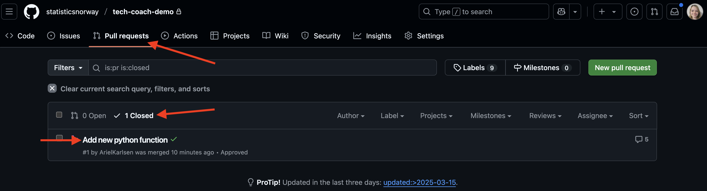
2. Nederst i pull requesten velger du “Revert“

   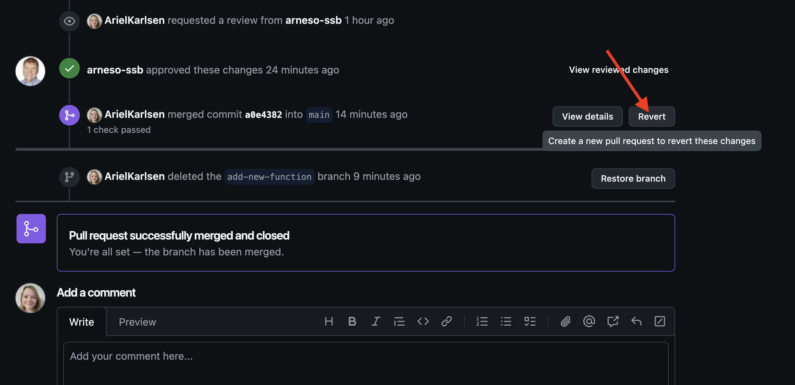
3. Se tidligere beskrivelse for godkjenning og videre arbeidsflyt.
