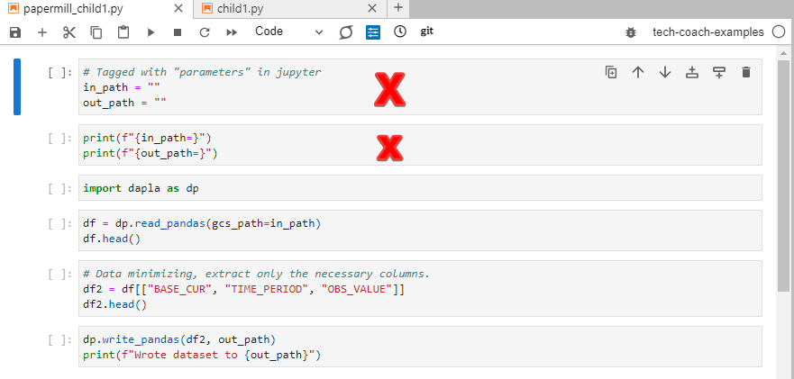
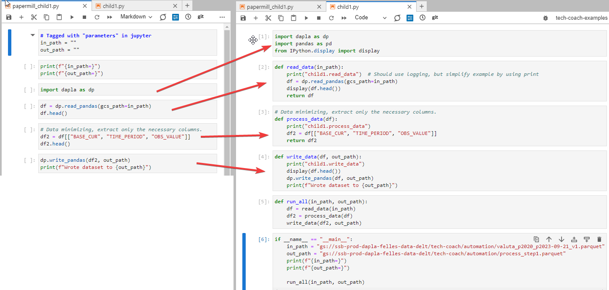

---
tags:
  - python
  - jupyter
  - automatisering
  - howto-kvakk-test
  - howto-kvakk
---

# Hvordan automatisere Jupyter notebooks ved bruk av funksjoner?

Status: <mark style="background: #baf3db;">I BRUK</mark>

> [!IMPORTANT]
> Å dele opp Jupyter notebooks i funksjoner er nyttig av minst to grunner:
>
> 1. Det muliggjør testing av koden.
> 2. Du kan automatisere kjøring av mange notebooks etter hverandre ved å kalle funksjoner. Dette er 10-100 ganger raskere enn å bruke Papermill og gir bedre programstruktur. Den anbefalte måte å kjøre flere notebooks etter hverandre på er ved å bruke funksjoner, slik som beskrevet her.

## Eksempel

GitHub-repoet [tech-coach-examples](https://github.com/statisticsnorway/tech-coach-examples/tree/main) inneholder eksempel på automatisering med papermill og automatisering ved å bruke pythonfunksjoner. Begge eksemplene automatiserer den samme koden som består av to notebooks, `child1.py` og `child2.py`.

Kort om hva eksempelnotebookene gjør:

- `child1.py` leser inn valutakurser, gjør dataminimering og lagrer resultatet til fil. Typisk det som gjøres fra kildedata til inndata.
- `child2.py` leser opp filen, beregner gjennomsnittlig valutakurs per måned for hver valuta og lagrer til fil.

I begge eksemplene lages det en overordnet notebook, `parent`, som kjører child-notebookene. [Papermill-mappen](https://github.com/statisticsnorway/tech-coach-examples/tree/main/src/automation/papermill) viser hvordan dette gjøres for Papermill, mens [pythonfunctions-mappen](https://github.com/statisticsnorway/tech-coach-examples/tree/main/src/automation/pythonfunctions) viser hvordan det gjøres med funksjoner. Beskrivelsen nedenfor viser hvordan vi kommer fra papermill og over til eksemplet på automatisering ved hjelp av pythonfunksjoner.

## Konverter en notebook til funksjoner

Her er et eksempel på hvordan konvertere [papermill\_child1.py](https://github.com/statisticsnorway/tech-coach-examples/blob/main/src/automation/papermill/papermill_child1.py) til [child1.py](https://github.com/statisticsnorway/tech-coach-examples/blob/main/src/automation/pythonfunctions/child1.py):

1. Første punkt er å fjerne det som har med Papermill å gjøre.

   
2. Gjør om notebooken til å bestå av en eller flere funksjoner. Du kan gjøre om hele notebooken til å være kun én funksjon, men ofte er det lurt å dele den opp i funksjoner for hver logiske del, slik som vist nedenfor. Notebook-eksemplet består av innlesing, prosessering og skriving, som får hver sin funksjon.

   
3. Verdt å merke seg:

   1. Hvis du har brukt `df`, `df.head()` eller lignende for å vise dataframes underveis i koden, og vil beholde dette, så virker ikke det inne i funksjoner som standard. Men du kan få det til å virke ved å importere en display-funksjon og kapsle inn kallet i denne, slik som vist her:

      ```py
      from IPython.display import display

      def process_data(df):
        display(df.head())
      ```
   2. Tenk på hva funksjonene trenger av parametre, og hva de bør returnere. Prøv å unngå globale variable, da er det bedre å sende inn denne informasjonen til funksjonen som parameter eller som en konfig-fil.
   3. Hvis du skal importere “child-notebooks” som ikke ligger i samme mappe som `parent.py`, så må det ligge en `__init__.py`-fil i mappen til child-notebookene. Se beskrivelse av hvordan gjenbruke funksjoner fra lokale pakker.
   4. Du slipper å lagre til fil for å overføre noe fra en notebook til en annen.
4. Hvis du har flere funksjoner i notebooken, så er det lurt å lage en `run_all()` funksjon som kjører alle funksjonene. Da blir det mer ryddig i den overordnede notebooken (`parent.py`), som bare trenger å kalle ut `run_all()` på hver enkelt child-notebook.
5. Legg til en `if __name__ == "main":` blokk helt til sist i filen. Denne blokken kjøres ikke når du importer den i en annen fil (`parent.py`), men kjøres bare når du kjører notebooken selv, eller fra kommandolinja. I denne blokken legger du inn parametre du vil kjøre koden med når du kjører notebooken alene. Eksempel:

   ```py
   if __name__ == "__main__":
       in_path = "gs://ssb-prod-dapla-felles-data-delt/tech-coach/automation/valuta_p2020_p2023-09-21_v1.parquet"
       out_path = "gs://ssb-prod-dapla-felles-data-delt/tech-coach/automation/process_step1.parquet"
       run_all(in_path, out_path)
   ```
6. Gjør tilsvarende for alle andre child-notebooks.

## Opprett overordnet notebook

Denne notebooken (`parent.py`) kjører alle de andre child-notebookene. Det den gjør er å importere child-notebookene, sette opp parametre og kalle run\_all() på hver av child-notebookene, ala dette:

```py
import child1
import child2

...
child1.run_all(inndata_path, process_step1_path)
child2.run_all(process_step1_path, klargjort_path)
```

Fullt eksempel finner du i [parent.py](https://github.com/statisticsnorway/tech-coach-examples/blob/main/src/automation/pythonfunctions/parent.py)
