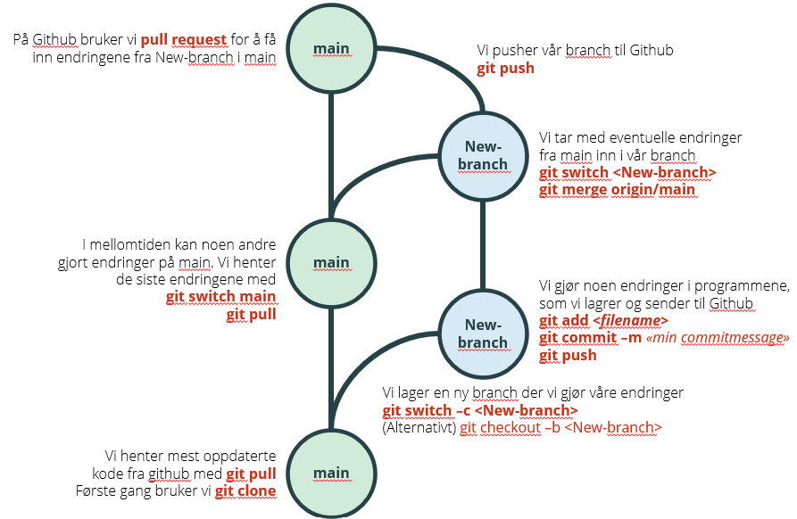

# Hvordan er anbefalt git arbeidsflyt?

Status: <mark style="background: #baf3db;">I BRUK</mark>

> [!IMPORTANT]
> Denne siden beskriver anbefalt git arbeidsflyt fra man begynner på en ny oppgave til den er avsluttet og merget tilbake til hovedgreina.

## \uD83D\uDCD8 Instruksjoner

1. Sørg for at du har et lokalt repo med nyeste versjon av hovedgreina (main eller master):

   1. Hvis det aktuelle repoet ikke er klonet ut ennå:

      ```bash
      git clone \<repo-url\>
      ```
   2. Hvis du allerede har clonet ut repoet, så gå til repo-katalogen og sjekk at du ikke har endrede filer før du oppdaterer lokalt repo med eventuelle nye endringer fra GitHub.

      1. Sjekkk om du har endrede filer siden siste commit med kommandoen: `git status`  
         Har du endrede filer kan du enten lagre endringene ved å committe dem, som beskrevet i punkt 3, eller forkaste endringene ved å kjøre kommandoen `git reset --hard HEAD`
      2. Oppdater lokalt repo med med eventuelle nye endringer fra GitHub:

         ```bash
         git switch main   # Gitt at hovedgreina heter main. Kan også være master.
         git pull
         ```
2. Opprett en ny branch for aktiviteten du skal gjøre. Hvis dere bruker Jira for oppgavehåndtering, så bør branchnavnet begynne med Jira-id til saken som prefiks. Da skapes det en automatisk kobling til Jira-saken. Eksempel:

   ```bash
   git switch -c DAPLA-132-add-package
   ```
3. Nå er du klar til å gjøre endringer i koden. Gjør endringer og lag en commit når du er ferdig med en del-bit. En commit vil si at man lagrer et snapshot/øyeblikksbilde av filene akkurat slik de er nå, og du lager en commit slik:

   ```java
   git status         # Viser hvilke filer som er endret, nye eller er klare for commit.
   git add \<filnavn\>  # For alle filer du vil ha med i committen.
   git commit         # Du kan også bruke git commit -m "Tekst som beskriver endring".
   git push           # Sender endringen til GitHub. 
   ```
4. Når du skriver git commit vil git starte en editor hvor du kan beskrive endringen. Her er noen tips til hvordan skrive gode commit-meldinger: <https://cbea.ms/git-commit/>. Hvis du inkuderer Jira-saksnummeret (eks. `PF-321`) i commit-meldingen, vil en lenke til committen vises i Jira-saken. [Eksempel på commit-melding](Hvordan%20er%20anbefalt%20git%20arbeidsflyt_/Eksempel%20på%20commit-melding.md)
5. Gjenta punkt 4 til hele oppgaven er ferdig kodet.
6. Merge inn eventuelle endringer fra hovedgreina inn til din grein. Dette gjør vi fordi det er lettere å løse mergekonflikter lokalt enn å løse dem på pull-request i GitHub. Sjekk først at du har en “ren” git status som beskrevet i punk 1 b. Deretter oppdaterer du slik:

   ```bash
   git fetch               # Synkroniserer origin-biten av ditt lokale repo med GitHub.
   git merge origin/main   # Hvis hovedgreina heter master så bytter du ut main med master.
   git push
   ```
7. Hvis du får merge-konflikt på punkt 7 så løser du dette som beskrevet på [Hvordan løse en merge-konflikt?](Hvordan%20løse%20en%20merge-konflikt_.md) og avslutt med `git add` på endrede filer, `git commit` og `git push`.
8. Gå til repoet på GitHub og lag en pull request. Det vil si at du ber andre om å se på og kommentere endringene dine. Eventuelle ting som må rettes på løser du vanlig måte med endring, git commit og git push til utviklingsgreina.
9. Når pull requesten blir godkjent klikker du på merge-knappen i GitHub, og deretter på “delete branch” siden vi ikke trenger greina lenger.

## Bilde av anbefalt git arbeidsflyt



Figur laget av Mons Oppedal.

## \uD83D\uDCCB Relaterte artikler

##### Filtrer etter etikett

Det er ingen elementer i de valgte etikettene akkurat nå.
