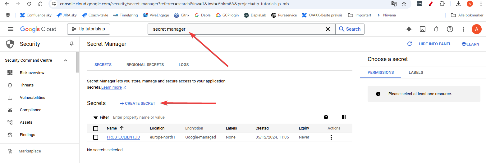
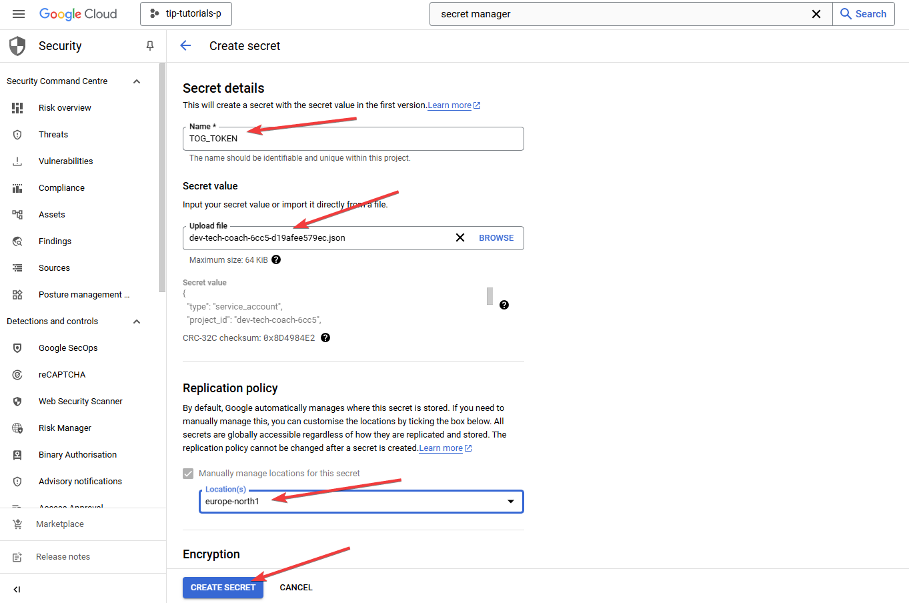
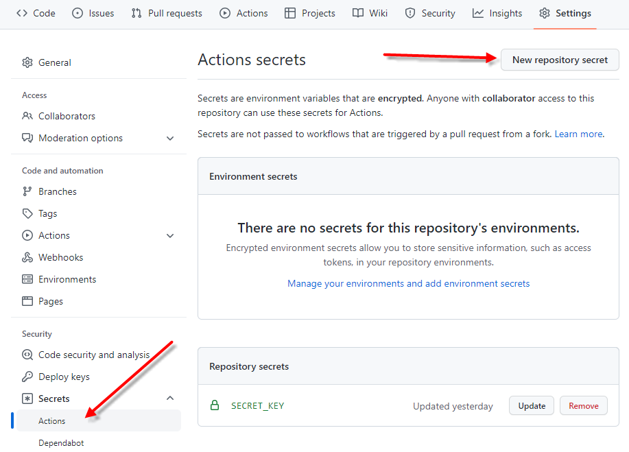
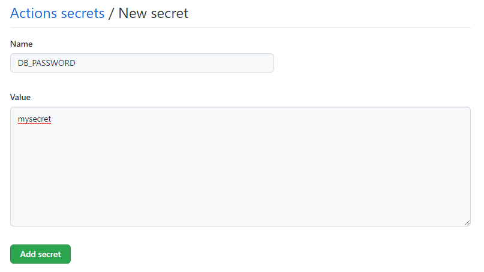

---
tags:
  - passord
  - kb-how-to-article
  - howto-kvakk-git
  - git
  - google-secret-manager
---

# Hvordan håndtere hemmeligheter og passord i git?

Status: <mark style="background: #baf3db;">I BRUK</mark>

> [!IMPORTANT]
> En del ganger trenger man tilgang til passord, tokens og andre hemmeligheter i kildekoden, men de skal ikke lagres ukryptert i kildekoden. Denne siden beskriver hvordan man kan håndtere dette på en sikker måte.

Hemmeligheter og passord kan lagres i [Google Secret Manager](https://cloud.google.com/secret-manager), som [GitHub Secrets](https://docs.github.com/en/actions/security-guides/encrypted-secrets) eller i lokal `.env`-fil. Google Secret Manager er den anbefalte løsningen.

Se også på siden [Hva anses som hemmeligheter i kode i SSB?](Hvordan%20håndtere%20hemmeligheter%20og%20passord%20i%20git_/Hva%20anses%20som%20hemmeligheter%20i%20kode%20i%20SSB_.md)

Oversikt:

## Google Secret Manager

> [!IMPORTANT]
> Vi mangler foreløpig en brukervennlig tjeneste på Dapla for bruk av Google Secret Manager (GSM) for statistikkteam, men man kan få det til ved noen manuelle steg som beskrevet her.

1. **Få tilgang til Google Secret Manager**: Vanlige dapla-team (managed) har som standard ikke tilgang til tjenesten. For å få tilgang må man legge til noen linjer i en fil i dapla-teamets iac-repo.  
   Eksempel: Dapla-teamet `tip-tutorials`, som har prosjekt-ID `tip-tutorials-p-mb` for prod-prosjektet . Erstatt dette med ditt eget dapla-team og dets prosjekt-ID i eksemplet nedenfor. Prosjekt-ID finner du slik: [Hvordan finner jeg et google prosjekt sin prosjekt ID?](https://manual.dapla.ssb.no/faq.html#hvordan-finner-jeg-et-google-prosjekt-sin-prosjekt-id)   
     
   Åpne filen `infra/projects/tip-tutorials-prod/iam.yaml` i repoet `tip-tutorials-iac` (husk å erstatte tip-tutorials med ditt eget dapla-team). og legg til følgende bit: ([se kode](https://github.com/statisticsnorway/tip-tutorials-iac/blob/main/infra/projects/tip-tutorials-prod/iam.yaml#L14-L19)).  
     
   Deretter lagrer du, oppretter branch, comitter, pusher og lager pull request som beskrevet i [Hvordan er anbefalt git arbeidsflyt?](Hvordan%20er%20anbefalt%20git%20arbeidsflyt_.md) Pull requesten må godkjennes av en som har rollen data-admin på Dapla teamet ditt.  
     
   Hvis du vil ha tilgang til GSM i test-prosjektet også, så gjør du helt tilsvarende der. Bare endre filstien til iam.yaml-fila og prosjekt-ID'en til å gjenspeile test-prosjektet.
2. **Legg inn hemmeligheten i Google Secret Manager**: Logg inn på [Google Cloud Console](https://console.cloud.google.com/) og velg prod-prosjektet til dapla-teamet ditt (`tip-tutorials-p`). Se bilde nedenfor. Søk etter Secret Manager og klikk på Create Secret.

   

Deretter fyller du ut med navn på hemmeligheten din. Det anbefales å velge et navn på hemmeligheten som ikke er sensitivt, for da kan du legge det på GitHub, og det forenkler en god del. Et navn som for eksempel ENTUR\_BIGQUERY\_SA bør man unngå, for det sier både hvilke firma det gjelder, hvilken tjeneste og type hemmelighet. Da er de bedre med TOG\_TOKEN, PASSORD1 eller lignende.  
  
Videre kopierer du inn hemmeligheten din i feltet Secret value, eventuelt importerer den fra en fil. I Locations-feltet velger du `europe-north1`. De andre feltene kan du beholde med standardverdier.



3. **Bruk hemmeligheten i koden din:** ssb-fagfunksjoner har en funksjon du kan bruke for å hente ut hemmeligheten. Det er så enkelt som dette:

   ```py
   from fagfunksjoner.dapla.gsm import get_secret_version

   secret_id = "FROST_CLIENT_ID"          # Erstatt med din ID
   project_id = "tip-tutorials-p-mb"      # Erstatt med din project ID
   secret = get_secret_version(project_id, secret_id)
   ```

## .env-fil: Lokalt, på Jupyter og DaplaLab

Kort fortalt er løsningen her å lagre hemmelighetene som miljøvariabler, og så lese disse inn i koden der de trengs. Gjelder det større filer så anbefales det i stedet å kryptere filen og lagre nøkkelen i en miljøvariabel. Og så dekryptere innholdet med nøkkel innlest fra miljøvariabel.

Det finnes verktøy og biblioteker som hjelper oss til å gjøre dette. Repoet [secret-test](https://github.com/arneso-ssb/secrets-test) er et eksempelrepo som viser slik bruk, både lokalt og ved bygging med GitHub Actions.

Man kan sette miljøvariablene manuelt, men det er tungvint og lite praktisk hvis man for eksempel bytter mellom prod-, staging- og dev-miljøer. I stedet setter hver utvikler miljøvariablene i en `.env` fil, og som legges i rotkatalogen på det klonede repoet.

> [!WARNING]
> `.env` filen skal **ikke** lagres i git.

\uD83D\uDCD8 **Instruksjoner**

1. Sett opp fila `.gitignore` i repoet slik at `.env`-filer ikke blir comittet. Har du opprettet repoet med kommandoen `ssb-project` eller fra ssb-minimal-template så er dette allerede i orden. Se [anbefalt .gitignore](https://github.com/statisticsnorway/kvakk-git-tools/blob/main/kvakk_git_tools/recommended/gitignore).
2. Opprett en `.env`-fil i rotkatalogen til repoet og legg inn miljøvariablene for hemmelighetene der. Eksempel:

   ```bash
   API_USERNAME=myusername
   API_PASSWORD=mysecret
   TECH_COACH_GCP_PROJECT_ID="prod-tech-coach-54f3"
   API_TOKEN=v%)9n7kg^65(4-uir6!pa@oqqsdn8agv9h8
   ```
3. Eksempel på innlesing og bruk i python-kode, bruker [python-dotenv](https://github.com/theskumar/python-dotenv) biblioteket:

   ```py
   from dotenv import load_dotenv
   import os

   load_dotenv()  # Laster inn .env fil og setter miljøvariable
   project = os.getenv("TECH_COACH_GCP_PROJECT_ID")
   write_path_base = f"gs://ssb-{project}-sync-down/data/"
   ```
4. Eksempel på innlesing og bruk i Jupyter notebook:

   ```py
   %load_ext dotenv
   %dotenv
   # Og deretter som i python-eksemplet ovenfor
   ```
5. Eksempel på innlesing og bruk i R, bruker [dotenv](https://github.com/gaborcsardi/dotenv)-biblioteket:

   ```java
   library(dotenv)
   Sys.getenv("TECH_COACH_GCP_PROJECT_ID")
   ```

## GitHub Secrets: Ved bygging med GitHub Actions

I GitHub kan man lagre hemmeligheter på en sikker måte og som GitHub Actions har tilgang til. Man kan lagre hemmeligheter på organisasjonsnivå, repo-nivå og miljø-nivå. Miljø-nivå vil si at man kan definere ett eller flere miljøer, for eksempel prod, staging og dev, og så har hver av disse sitt eget sett av hemmelighetene. Det som er vist i beskrivelsen her er hemmeligheter på repo-nivå, men bruk det som er mest egnet for ditt prosjekt.

\uD83D\uDCD8 **Instruksjoner**

1. Logg inn på GitHub, gå til repoet og velg Settings. Velg Så Secrets, Actions og “New repository secret” som vist på bildet nedenfor.

   
2. Oppgi navn på miljøvariabelen du ønsker å bruke. Navnekonvensjonen er å bruke store bokstaver og holde seg til [disse tegnene](https://hexdocs.pm/dotenvy/dotenv-file-format.html#variable-names). Lim så inn passordet eller hemmeligheten.

   
3. I GitHub Action workflowen gir du koden din tilgang på miljøvariabelene på denne måten:  
   (fullt eksempel finner du i repoet [secrets-test](https://github.com/arneso-ssb/secrets-test/blob/main/.github/workflows/main.yml)).

   ```java
   env:
     API_PASSWORD: ${{ secrets.API_PASSWORD}}
   ```
4. Med GitHub Action kan du også hente og bruke hemmeligheter som er lagret i Google Secret Manager. Det gjør du ved å bruke <https://github.com/marketplace/actions/get-secret-manager-secrets>.
