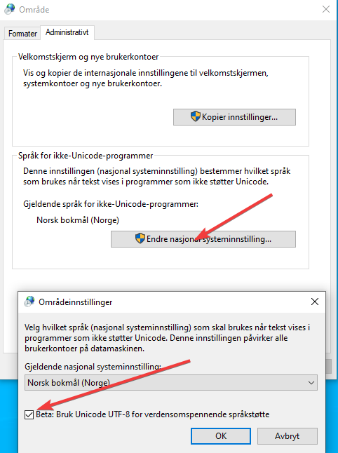

---
tags:
  - git
  - kb-how-to-article
  - utf
---

# Hvordan sette opp Windows til å bruke UTF-8 som tegnsett?

> [!IMPORTANT]
> Kommandolinjeverkøyet `nbstripout` brukes for å fjerne output Jupyter notebooks. For å få dette til å virke på Windows må du endre Windows fra å bruke UTF-16 til å bruke UTF-8 som tegnsett i kommandovinduet. Denne siden beskriver hvordan.

## \uD83D\uDCD8 Instruksjoner

1. Du trenger lokaladministratorrettigheter for å endre innstillingen. Send en henvendelse til [Kundeservice](https://ssb.tmsportal.no/userweb/UserWebStart.aspx) og be om lokaladministratorrettigheter hvis du ikke allerede har det.
2. Åpne “Innstillinger” i Windows og søk etter “Språkinnstillinger”. Velg så “Administrative språkinnstillinger.
3. I det nye vinduet klikker du først på “Endre nasjonal systeminnstilling”. Du vil da bli spurt om lokaladministrator passord. Etter på huker du av for “Bruk Unicode UTF-8” og klikker på OK.

   
4. Restart maskinen.

## \uD83D\uDCCB Relaterte artikler

##### Filtrer etter etikett

Det er ingen elementer i de valgte etikettene akkurat nå.
