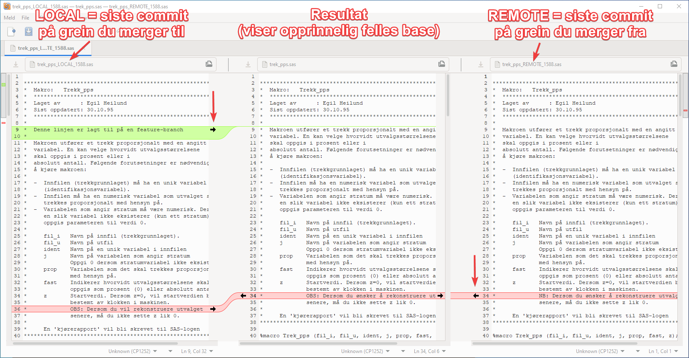
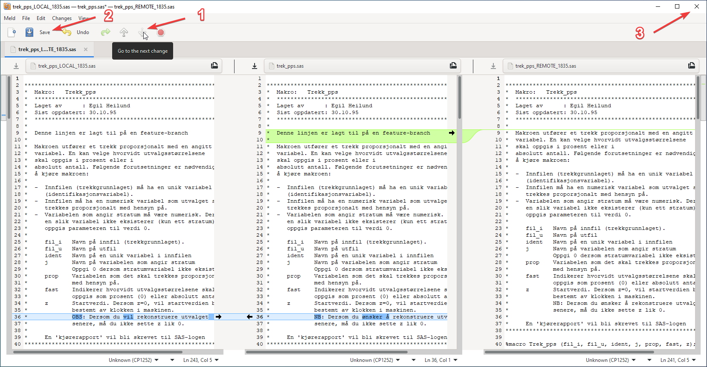

---
tags:
  - merge
  - kb-how-to-article
  - git
  - howto-kvakk-git
---

# Hvordan løse en merge-konflikt?

Status: <mark style="background: #baf3db;">I BRUK</mark>

**Hva er en merge-konflikt?** Hvis du og en annen person har endret på samme linje i en fil, så vil ikke git merge vite hvilken av linjene den skal velge. Da har man en merge-konflikt, og du må manuelt velge hvilken versjon du ønsker.

**Forutsetninger:** Denne beskrivelsen forutsetter at du har satt opp et grafisk diff- og mergeverktøy som beskrevet på [Hvordan konfigurere git (git config) etter SSB-standard?](Hvordan%20konfigurere%20git%20(git%20config)%20etter%20SSB-standard_.md). NB! På Dapla/Jupyterlab virker det ikke å sette opp grafisk diff- og mergeverktøy, så der gjør du følgende når du får mergekonflikt:

- På JupyterLab i prod-sonen: Logg inn på en annen Linux-server, for eksempel SAS-terminal. Der har du det samme hjemmeområdet som på JupyterLab, og også mulighet for å kjøre grafiske programmer. Gå til det aktuelle repoet og følg instruksjonene fra punkt 1 nedenfor.
- På Dapla: Her får du ikke tak i hjemmeområdet på noen annen måte. Det du gjør da er å clone ut repoet til din Windows/Mac og løser mergekonflikten der. Det vil si å gå til repoet, sjekke ut aktuell grein, kjøre merge-kommando, du får mergekonflikt, og deretter følger du instruksjonene fra punkt 1 nedenfor.

Eksempel på mergekonflikt: La oss si at du jobber på en grein, my-feature, og ønsker å merge oppdateringer som har kommet på hovedgreina inn til din my-feature grein. Dvs. noe ala dette:

```plain
git checkout my-feature
git fetch                 # For å oppdatere ditt repo med siste endringer fra GitHub
git merge origin/main     # Den nye fetchede versjonen ligger under origin/main
Auto-merging README.md
CONFLICT (content): Merge conflict in README.md
Automatic merge failed; fix conflicts and then commit the result.
```

## Instruksjoner

1. Kjør kommandoen `git mergetool` for å starte det konfigurerte mergeverkøyet.  
   I Meld får du opp tre versjoner av fila med konflikt:

   - Til venstre: Denne kalles LOCAL og viser den siste comitten på den greina du merger **til**, i dette eksemplet: den siste comitten på `my-feature`-greina.
   - I midten: Resultatet, dvs. det du ender opp med når du lagrer. Initielt viser denne det som kalles BASE. Det vil si den nærmeste comitten som er felles for de to greinene du merger.
   - Til høyre: Denne kalles REMOTE og viser den siste comitten på den greina du merger **fra**, i dette eksemplet: den siste comitten på `origin/main`-greina.

   Det vil si at i vinduet til venstre ser du de endringene som har kommet inn på til-greina sammenlignet med opprinnelig versjon (BASE), og i vinduet til høyre ser du de endringene som har kommet inn på fra-greina siden opprinnelig versjon.

   
2. Du skal nå velge hvilke endringer du vil ta inn. Gjør følgende:

   1. Velg de endringene du ta inn ved å klikke på de aktuelle svarte pilene, se eksempel markert med røde piler på figuren ovenfor. Her beholder vi tilleggslinja som vi la inn på til-greina (grønn), mens på den andre konflikten velger vi å ta inn endringen fra fra-greina. I det midtre vinduet kan du også editere teksten direkte hvis du for eksempel i en konflikt ønsker å ha en kombinasjon av det som er gjort på til- og fra-greinene.
   2. Fortsett nedover fila til du har løst ut alle endringene. Ved å klikke på "pil ned" ikonet (go to next change), markert med tallet 1 på figuren nedenfor, så får du Meld til å hoppe til neste endring.

      
   3. Til slutt klikker du på Save-knappen (markert med tallet 2 på figuren ovenfor) og lukker vinduet (markert med tallet 3).
   4. Hvis det er flere filer med konflikt så vil Meld automatisk gjenåpnes igjen med de nye filene, og stegene 1-3 gjentas til alle konflikter er løst.

## \uD83D\uDCCB Relaterte artikler

- Side:

  [Hvordan bruke vscode til å skrive og kjøre kode på Dapla?](../../../../../Arne%20Sørli/Oversikt/Verktøy/Hvordan%20bruke%20vscode%20til%20å%20skrive%20og%20kjøre%20kode%20på%20Dapla_.md)
- Side:

  [Hvordan legge ut API-dokumentasjon på GitHub Pages?](../../../../../Arne%20Sørli/Oversikt/Python/Hvordan%20legge%20ut%20API-dokumentasjon%20på%20GitHub%20Pages_.md)
- Side:

  [Hvordan sette opp SonarCloud for bruk med python?](../../../../../Arne%20Sørli/Oversikt/Verktøy/Hvordan%20sette%20opp%20SonarCloud%20for%20bruk%20med%20python_.md)
- Side:

  [Hvordan sette opp PyCharm på Windows for bruk med PySpark?](../../../../../Arne%20Sørli/Oversikt/Verktøy/Hvordan%20sette%20opp%20PyCharm%20på%20Windows%20for%20bruk%20med%20PySpark_.md)
- Side:

  [Hvordan lage et JupyterLab api-token?](../../../../../Arne%20Sørli/Oversikt/Verktøy/Hvordan%20lage%20et%20JupyterLab%20api-token_.md)
