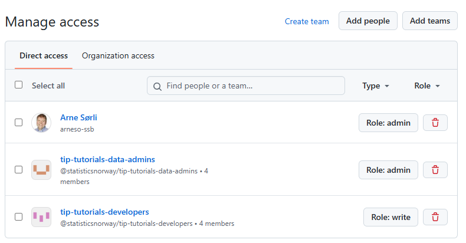

---
tags:
  - howto-kvakk
  - kb-how-to-article
  - howto-kvakk-git
---

# Hvordan opprette nytt GitHub-repo?

Status: <mark style="background: #baf3db;">I BRUK</mark>

GitHub er den sentrale lagringsplassen for SSB sine kodelagre (også kalt repositories eller repoer). Det er en flat struktur på repoene, ikke en hierarkisk ordning som i BitBucket.

## \uD83D\uDCD8 Instruksjoner

### Før du begynner

- Bestem navn på det nye GitHub repoet. Reponavnet skal følge SSBs navnestandard for GitHub-repoer, som beskrevet i arkitekturbeslutning [ADR0014](https://github.com/statisticsnorway/adr/blob/main/docs/0014-navnestandard-github-repoer.md).
- Bestem om repoet skal være public eller internal. Public vil si at alle i verden kan se innholdet i repoet, mens internal betyr at bare SSB-ansatte kan se innholdet. Arkitekturbeslutning ADR0006 sier: “*Alle som jobber med produksjonskode i SSB skal etterstrebe allmenn tilgjengeliggjøring av sin kildekode på GitHub. For at kode skal kunne være offentlig tilgjengelig må den oppfylle SSBs kriterier for åpen kildekode.*“ Kriteriene og flere detaljer finner dere i [ADR0006 - Retningslinjer for åpen kildekode i SSB](../ADR0006%20-%20Retningslinjer%20for%20åpen%20kildekode%20i%20SSB.md). GitHub repoer blir som standard opprettet som interne, men kan gjøres public ved å følge beskrivelsen [Hvordan opprette nytt GitHub-repo?](Hvordan%20opprette%20nytt%20GitHub-repo_.md).

### Opprette repo

Hvis du skal opprette et repo for statistikkproduksjon eller pythonbiblioteker, så bruk kommandolinjeverktøyet `ssb-project` i et terminalvindu på DaplaLab eller JupyterLab. Da får du det meste satt opp automatisk. Se [detaljert beskrivelse i Dapla-manualen](https://manual.dapla.ssb.no/statistikkere/jobbe-med-kode.html#med-github-repo). Deretter kan du hoppe til punktet [Hvordan opprette nytt GitHub-repo?](Hvordan%20opprette%20nytt%20GitHub-repo_.md).

Hvis du skal opprette et annet type repo enn nevnt ovenfor, så ser prosessen for oss i SSB slik ut:

1. Gå til [listen over repoer i GitHub-organisasjonen vår](https://github.com/orgs/statisticsnorway/repositories) og klikk på “New repository”-knappen.
2. Dersom du vet at det nye repoet ditt skal opprettes basert på en eksisterende mal, velger du denne i “Repository template”-nedtrekksmenyen. Hvis ikke, velg “ssb-minimal-template”.
3. Pass på at “statisticsnorway” står som eier av repoet og gi det et fornuftig navn og en beskrivelse som gjør at andre forstår hva repoet inneholder. Reponavnet skal følge SSBs navnestandard for GitHub-repoer, som beskrevet i [ADR0014](https://github.com/statisticsnorway/adr/blob/main/docs/0014-navnestandard-github-repoer.md).
4. Nye repoer blir som standard opprettet med synlighet internal. Hvis du ønsker at repoet skal være public, så sørg for at [ADR0006 - Retningslinjer for åpen kildekode i SSB](../ADR0006%20-%20Retningslinjer%20for%20åpen%20kildekode%20i%20SSB.md) er oppfylt og send så en e-post til [sikkerhetssenter@ssb.no](mailto:sikkerhetssenter@ssb.no) og be om at repoet blir gjort om til public. Send også en e-post til sikkerhetssenteret hvis du trenger å lage en fork av et public repo.
5. La avkryssingsfeltene for “*Initialize this repo with:*“ og “*mabl bot*” stå tomme.
6. Trykk på “Create repository”-knappen.

### Konfigurere repo

Det er viktig å sette opp repoet på en måte som er sikker og som muliggjør samarbeid for de som skal arbeide med koden i repoet. Disse valgene gjøres under “Settings” for repoet. Har du opprettet repoet med `ssb-project` så kan du hoppe rett til punkt 2.

1. *Beskytt hoved-gren*: Punktene nedenfor er krav for public repoer og anbefalinger for interne repoer. Klikk på “Branches” i innstilling-menyen og velg “Add classic branch protection rule”. I “Branch name pattern” fyller du ut navnet på grenen du vil beskytte, typisk “main”.

   1. Kryss av for “Require a pull request before merging” for å følge god praksis for samarbeid og review av endringer.

      1. Kryss av for “Require approvals” og velg at minst én annen person skal se på *og godkjenne* endringen.
      2. Kryss av for “Dismiss stale pull request approvals when new commits are pushed” for å unngå at noen kan legge til nye endringer i en allerede godkjent pull request og merge pull requesten uten at noen godkjenner disse nye endringene først.
   2. Lenger ned krysser du av for “Do not allow bypassing the above settings”.
   3. Lagre endringene ved å trykke på “Create”-knappen nederst.

### Hvordan angi hvem som skal kunne jobbe med repoet og topics?

For GitHub-repoer som tilhører et Dapla-team, så gi daplateamets data-admins gruppe admin-tilgang til repoet og daplateamets developers-gruppe skrivetilgang til repoet. Da blir tilganger til de aktuelle repoene automatisk oppdatert når personer meldes inn og at av teamet på Dapla Ctrl.

1. Klikk på Settings, “Collaborators and teams” og legg til de daplateam-gruppene og/eller enkeltpersonene som skal ha tilgang, med det tilgangsnivået de trenger. Det er lurt å sette opp minst to personer som administrator for repoet, slik at det ikke bare er en enkelt person som kan gjøre endringer i oppsettet. Eksempel:

   
2. For statistikkrepoer skal kortnavnene til statistikkene i repoet angis som topic på repoet. Python-biblioteker skal ha topic “pypi” og R-pakker topic “r-package”. Angi gjerne også flere topics for repoet, som sier noe om hva det inneholder og/eller brukes til. Se [GitHub sin dokumentasjon om topics](https://docs.github.com/en/repositories/managing-your-repositorys-settings-and-features/customizing-your-repository/classifying-your-repository-with-topics).

### Hvordan gjøre et GitHub repo public?

1. Sørg for at kriteriene i [ADR0006 - Retningslinjer for åpen kildekode i SSB](../ADR0006%20-%20Retningslinjer%20for%20åpen%20kildekode%20i%20SSB.md) er oppfylt.
2. Send en e-post til [sikkerhetssenter@ssb.no](mailto:sikkerhetssenter@ssb.no) og be om at repoet gjøres public.

### Til slutt

Etter at repoet er ferdig satt opp anbefales det å legge inn, eller sjekke at det finnes to filer i repoet:

1. `.gitattributes`. Settes opp som beskrevet her: [Hvordan konfigurere git (git config) etter SSB-standard?](Hvordan%20konfigurere%20git%20(git%20config)%20etter%20SSB-standard_.md)
2. `.gitignore` Gjør at filer som ikke bør legges inn i versjonskontroll vil bli ignorert av Git slik at de ikke legges til ved et uhell. En standard .gitignore fil for SSB som dekker Python, R og noen SSB-spesifikke ekskluderinger finner du her: <https://github.com/statisticsnorway/kvakk-git-tools/blob/main/src/kvakk_git_tools/recommended/gitignore>

## \uD83D\uDCCB Relaterte artikler

##### Filtrer etter etikett

Det er ingen elementer i de valgte etikettene akkurat nå.
