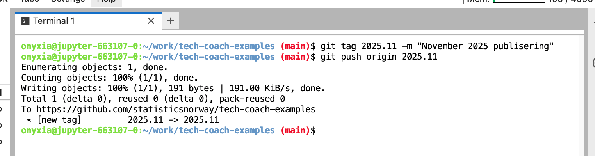
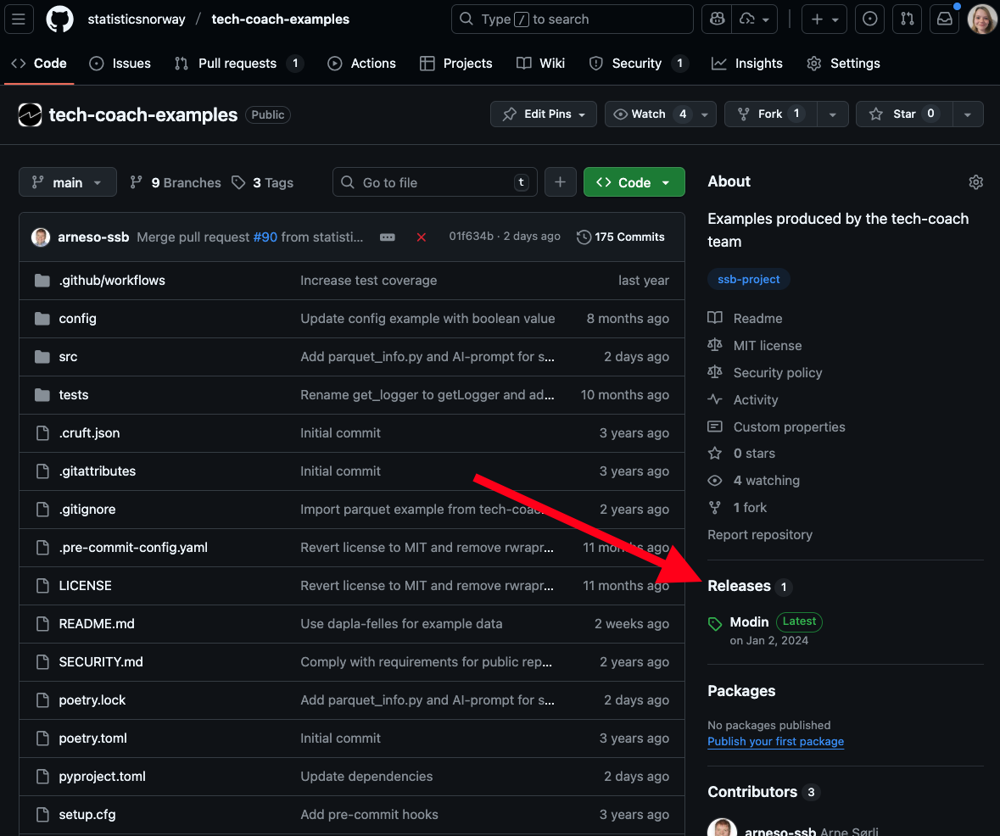
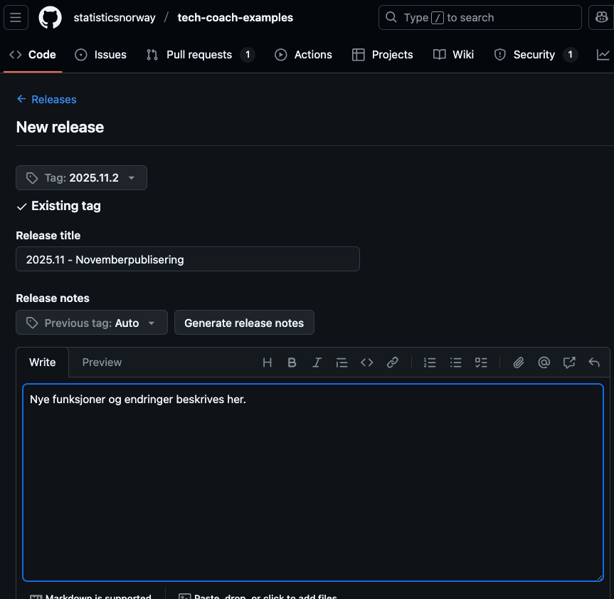

---
tags:
  - kb-how-to-article
  - howto-kvakk-git
---

# Hvordan tagge kode og lage en GitHub-release

Status: <mark style="background: #baf3db;">I BRUK</mark>

# Tag og Github-release

### Hva er en tag?

En tag i Git er et navngitt “stempel“ på en spesifikt commit i Git-historikken. Tagger brukes for å:

- Markere milepæler, for eksempel ved publisering av statistikk.
- Gjøre det enkelt å hente nøyaktig den versjonen av koden på et bestemt tidspunkt.

### Hva er en GitHub-release?

En GitHub-release bygger på en tag og fungerer som en mer menneskevennlig presentasjon av en ny versjon. En release brukes til å:

- Vise hva som er nytt siden sist versjon.
- Beskrive endringer i koden og dokumentasjon.

# Anbefalinger for navngiving og versjonering

\<TODO: Beskriv repoer som egner seg til å bruke tag + release\>

### Statistikk-repoer

For statistikk-repoer (repoer med prefiks`stat-`) anbefales [kalender versjonering](https://calver.org/).

- Format: `ÅÅÅÅ.MM` (f.eks `2025.03`)
- Patch-versjoner kan legges til ved behov: `2025.03.1`
- Postfiks kan brukes i taggen for å indikere eksperimentelle versjoner: `2025.03-beta`

Ved å bruke en dato-basert versjon vil man lettere kunne vite hvordan koden så ut ved publiseringstidspunktet. Det vil gjøre det enklere hvis man er nødt til å reprodusere statistikken.

### Oppdrags-repoer

For repoer med kode utviklet i forbindelse med oppdrag bør tagger basere seg på oppdragets navn eller år.

- Format:`oppdrag-<navn på oppdragsgiver/oppdrag>-løpenummer/år`
- For eksempel:

  - `oppdrag-skattedir-2025`
  - `oppdrag-nav-2024`

# Hvordan lage en git-tag

Tags kan enten lages i et terminal-vindu eller direkte i webgrensesnittet i GitHub.

### I webgrensesnittet

- En ny tag kan lages samtidig som man lager en GitHub release.

  - Se “Hvordan lage en GitHub Release“ avsnittet lenger ned.

### I terminal-vinduet

1. Sjekk at du er på en main-branch med siste oppdatering fra GitHub repoet.

   ```java
   git pull
   ```
2. Lag en ny tag og gi den en kort beskrivelse.

   ```java
   git tag \<din_tag\> -m "\<beskrivelse\>"
   ```
3. Push taggen til GitHub repoet ditt.

   ```java
   git push origin \<din_tag\>
   ```

Eksempel:



# Hvordan lage en GitHub Release

1. Gå til repoet ditt på GitHub.
2. Klikk på Releases i menyen til høyre.

   
3. Trykk på Draft a new release.

> [!IMPORTANT]
> Hvis det er første release i repoet klikker du på den grønne knappen `Create a new release`.

4. Klikk på `Tag: Select tag` menyen.

   1. Velg den eksisterende taggen du ønsker å lage en release på.  
      *Eller*
   2. Klikk `Create new tag` knappen for å lage en ny tag.
5. Fyll inn:

   1. Release title (f.eks. “2025.11 - Novemberpublisering“).
   2. Description (kort forklaring på hva som er nytt, hva som inngår, eventuelle endringer).
6. 

   Trykk på `Publish release` nederst på siden.
